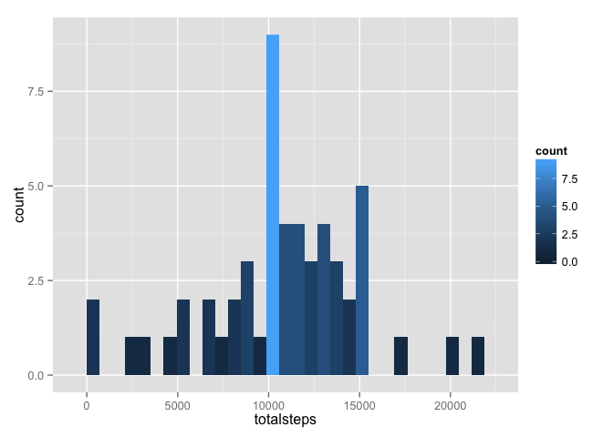
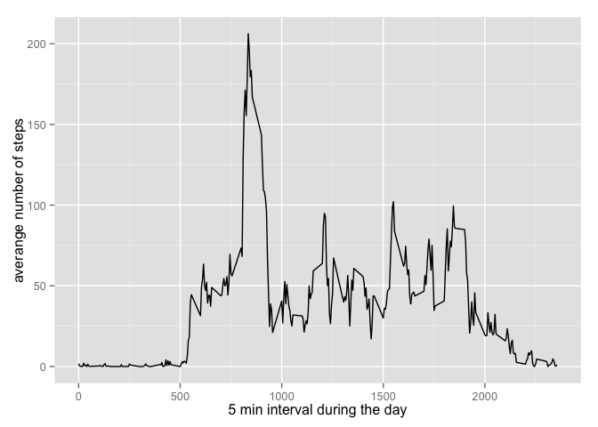
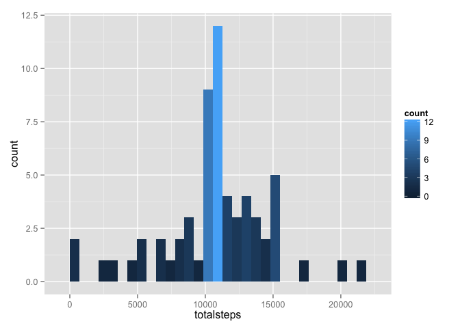
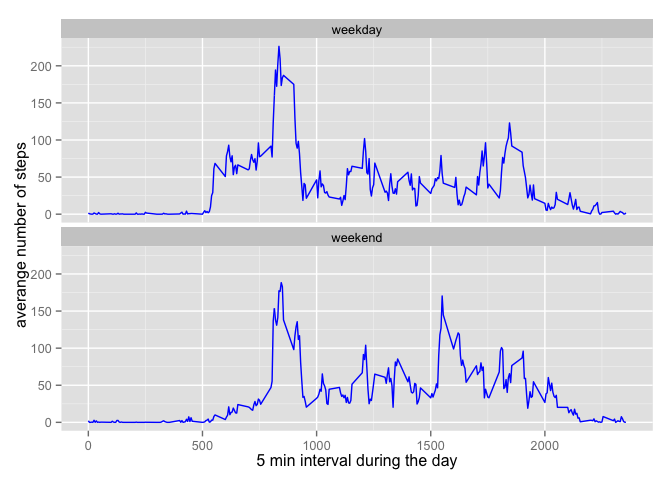

# Reproducible Research: Peer Assessment 1
Rodolfo Garzon  
March 8, 2015  


## Assignment introduction
Analyze the data from a personal activity monitor, this device collect data every 5 minutes through out the day, the data consists of two months of data from an anonymous source from October and November, 2013 and include the number of steps taken in 5 minutes intervals each day.


## Loading and preprocessing the data
The first step is load the data located in the file "activity.csv" from working directory /Users/rodolfogarzon/Documents/Coursera/5_Reproducible Research/Week2/Peer Asignment/RepData_PeerAssessment1

```r
activity <- read.csv("activity.csv")
```
a quick summary of the data

```
## 'data.frame':	17568 obs. of  3 variables:
##  $ steps   : int  NA NA NA NA NA NA NA NA NA NA ...
##  $ date    : Factor w/ 61 levels "2012-10-01","2012-10-02",..: 1 1 1 1 1 1 1 1 1 1 ...
##  $ interval: int  0 5 10 15 20 25 30 35 40 45 ...
```

## What is mean total number of steps taken per day?


```r
require(ggplot2)
```

```
## Loading required package: ggplot2
```

```r
activity.byDay <- aggregate(activity$steps, by=list(activity$date), FUN="sum")
names(activity.byDay) <- c("date", "totalsteps")
ggplot(activity.byDay, aes(x = totalsteps)) + geom_histogram(aes(fill = ..count..))
```

```
## stat_bin: binwidth defaulted to range/30. Use 'binwidth = x' to adjust this.
```

 

The mean of the total number of steps taken by day is 10766.1886792; 
the median is 10765


## What is the average daily activity pattern?
we get the averange number of steps taken every 5 minutes across all days (10-01-2012 to 11-30-2012); we need to remove any "na" value from our dataset in order to be able to calculate properly the averange.


```r
averange.byday <- aggregate(activity$steps, by=list(activity$interval), FUN="mean", na.rm="TRUE")
names(averange.byday) <- c("interval", "averange")
head(averange.byday)
```

```
##   interval  averange
## 1        0 1.7169811
## 2        5 0.3396226
## 3       10 0.1320755
## 4       15 0.1509434
## 5       20 0.0754717
## 6       25 2.0943396
```

```r
series <- ggplot(averange.byday, aes(x = interval, y = averange)) + geom_line() + xlab("5 min interval during the day") + ylab("averange number of steps")
series
```

 

Getting the maximum number of steps

```r
max(averange.byday$averange)
```

and getting the interval that contains the maximum value

```r
averange.byday[averange.byday$averange == max(averange.byday$averange),1]
```

The interval 835 contains the maximum number of steps 206.1698113


## Imputing missing values


```r
length(which(is.na(activity$steps)))
```

The total number of rows with missing values is 2304

We have decide that we will fill the NA values with the averange of the interval across all the days; in order to do that first we need to merge the activity data fram with the averange interval data frame, as the both data frames have different lenght, we will use cbind so the averange data frame will be repeat across all the interval on all days


```r
activity.plus <- cbind(activity, averange.byday)
```


```
##    steps       date interval interval  averange
## 1     NA 2012-10-01        0        0 1.7169811
## 2     NA 2012-10-01        5        5 0.3396226
## 3     NA 2012-10-01       10       10 0.1320755
## 4     NA 2012-10-01       15       15 0.1509434
## 5     NA 2012-10-01       20       20 0.0754717
## 6     NA 2012-10-01       25       25 2.0943396
## 7     NA 2012-10-01       30       30 0.5283019
## 8     NA 2012-10-01       35       35 0.8679245
## 9     NA 2012-10-01       40       40 0.0000000
## 10    NA 2012-10-01       45       45 1.4716981
```

```
##       steps       date interval interval  averange
## 17559    NA 2012-11-30     2310     2310 0.0000000
## 17560    NA 2012-11-30     2315     2315 0.8301887
## 17561    NA 2012-11-30     2320     2320 0.9622642
## 17562    NA 2012-11-30     2325     2325 1.5849057
## 17563    NA 2012-11-30     2330     2330 2.6037736
## 17564    NA 2012-11-30     2335     2335 4.6981132
## 17565    NA 2012-11-30     2340     2340 3.3018868
## 17566    NA 2012-11-30     2345     2345 0.6415094
## 17567    NA 2012-11-30     2350     2350 0.2264151
## 17568    NA 2012-11-30     2355     2355 1.0754717
```
we can identify the rows with NA with the following code

```r
which(is.na(activity$steps))
```

now, we replace the NA values with the correspondand averange value for the interval as follow


```r
activity.plus$steps[is.na(activity.plus$steps)] <- activity.plus$averange[is.na(activity.plus$steps)]
```

the result is a subset as follow

```r
activity.plus <- subset( activity.plus, select = c("steps", "date", "interval"))
```

```
##        steps       date interval
## 1  1.7169811 2012-10-01        0
## 2  0.3396226 2012-10-01        5
## 3  0.1320755 2012-10-01       10
## 4  0.1509434 2012-10-01       15
## 5  0.0754717 2012-10-01       20
## 6  2.0943396 2012-10-01       25
## 7  0.5283019 2012-10-01       30
## 8  0.8679245 2012-10-01       35
## 9  0.0000000 2012-10-01       40
## 10 1.4716981 2012-10-01       45
```

```
##           steps       date interval
## 17559 0.0000000 2012-11-30     2310
## 17560 0.8301887 2012-11-30     2315
## 17561 0.9622642 2012-11-30     2320
## 17562 1.5849057 2012-11-30     2325
## 17563 2.6037736 2012-11-30     2330
## 17564 4.6981132 2012-11-30     2335
## 17565 3.3018868 2012-11-30     2340
## 17566 0.6415094 2012-11-30     2345
## 17567 0.2264151 2012-11-30     2350
## 17568 1.0754717 2012-11-30     2355
```


```r
activity.plus.byDay <- aggregate(activity.plus$steps, by=list(activity.plus$date), FUN="sum")
names(activity.plus.byDay) <- c("date", "totalsteps")
ggplot(activity.plus.byDay, aes(x = totalsteps)) + geom_histogram(aes(fill = ..count..))
```

```
## stat_bin: binwidth defaulted to range/30. Use 'binwidth = x' to adjust this.
```

 

Comparing the data frames with and without NA we got:  
  
Total number of steps on the data frame with NA is 570608  
Total number of steps on the data frame without NA is 656737.509434  


```r
activity.plus.byDay <- aggregate(activity.plus$steps, by=list(activity.plus$date), FUN="sum")
names(activity.plus.byDay) <- c("date", "totalsteps")
```

The mean of the total number of steps taken by day is 10766.1886792; 
the median is 10766.1886792

Comparing the result agains the mean and media using the data frame with NA, the mean is the same for both, median is different.


## Are there differences in activity patterns between weekdays and weekends?

In order to differenciate the data by day, we need to extract the day from the Date variable


```r
activity.days <- activity.plus
activity.days$wday <-  weekdays(as.Date(activity.plus$date))
weekdays <- c("Monday", "Tuesday", "Wednesday", "Thrusday", "Friday")
activity.days$daygroup <- ifelse(activity.days$wday %in% weekdays, "weekday", "weekend")
activity.days <- subset(activity.days, select = c("steps", "date", "interval", "daygroup"))
str(activity.days)
```

```
## 'data.frame':	17568 obs. of  4 variables:
##  $ steps   : num  1.717 0.3396 0.1321 0.1509 0.0755 ...
##  $ date    : Factor w/ 61 levels "2012-10-01","2012-10-02",..: 1 1 1 1 1 1 1 1 1 1 ...
##  $ interval: int  0 5 10 15 20 25 30 35 40 45 ...
##  $ daygroup: chr  "weekday" "weekday" "weekday" "weekday" ...
```

Comparing weekdays and weekends activity


```r
averange.weekday <- aggregate(activity.days$steps, by=list(activity.days$interval, activity.days$daygroup), FUN="mean", na.rm="TRUE")

names(averange.weekday) <- c("interval", "group", "averange") 
head(averange.weekday)
```

```
##   interval   group   averange
## 1        0 weekday 1.46069182
## 2        5 weekday 0.54716981
## 3       10 weekday 0.21278826
## 4       15 weekday 0.02096436
## 5       20 weekday 0.12159329
## 6       25 weekday 1.62421384
```

```r
ggplot(averange.weekday, aes(x = interval, y = averange)) + geom_line(color = "blue") + facet_wrap(~group, ncol = 1) + ylab("averange number of steps")+ xlab("5 min interval during the day") 
```

 


